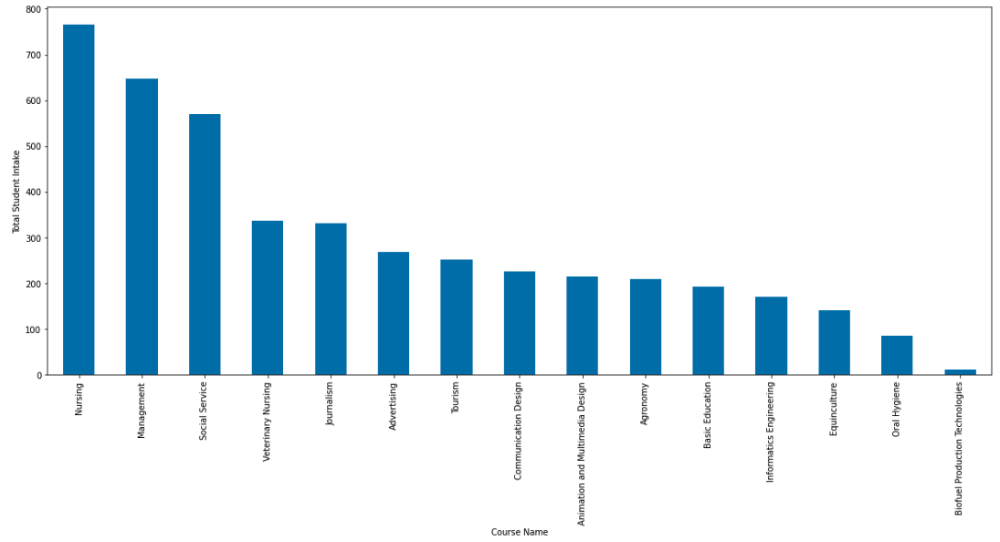
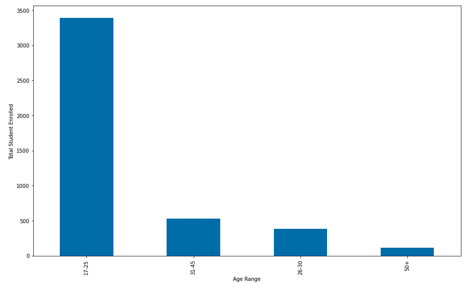
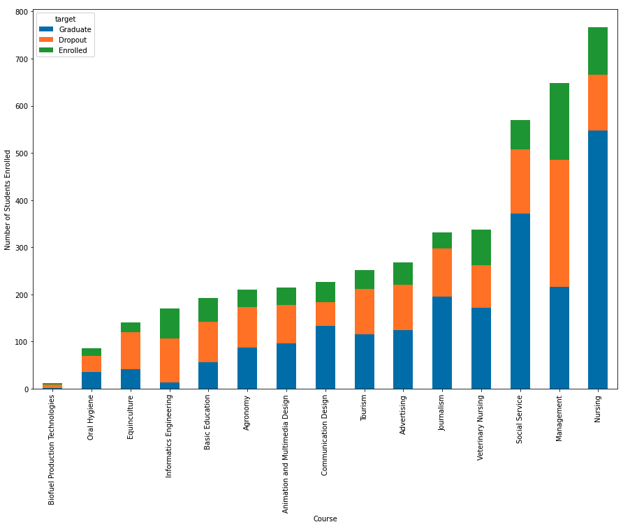
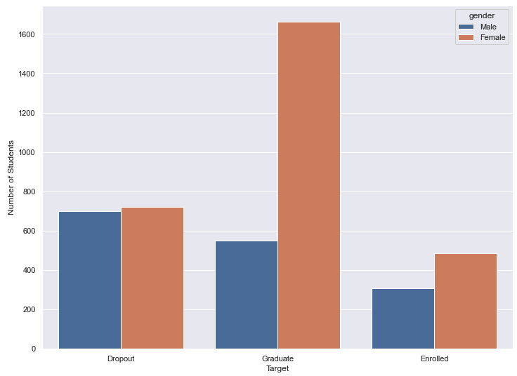
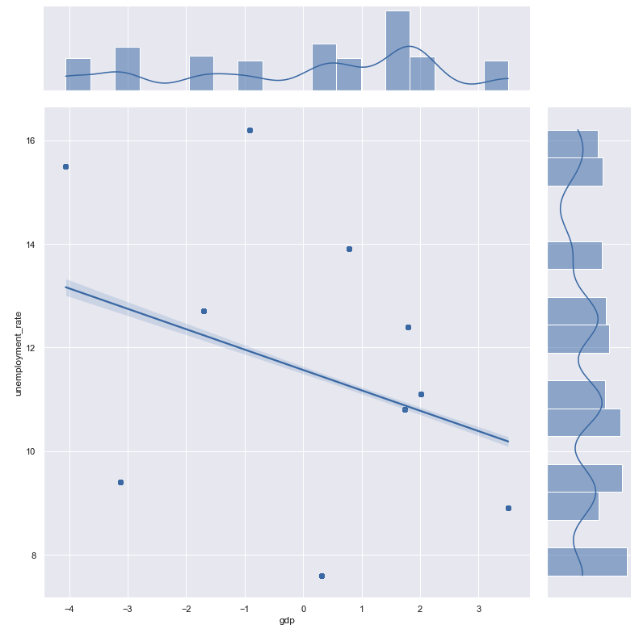
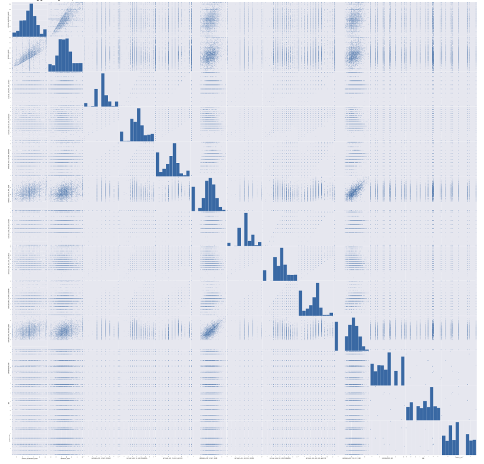
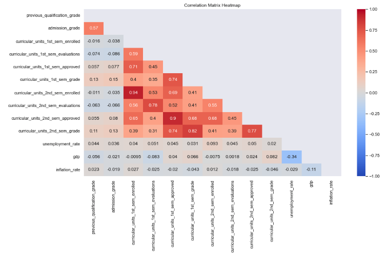

# Analyzing student's dropout and academic success
## Technologies and resource
- Python 3.6
- Analysis libraries: numpy, pandas
- Visualization libraries: matplotlib, seaborn
- Author: Wendy Ha
- Datasets: attached on github's folder
- Dataset features' description: https://drive.google.com/file/d/196pHYmHcZWwuKEgetPp5GQQ3cSZXpZ-C/view
## Objective
This report discusses the methods involved in combining, cleaning, and exploratory analysis of the “Predict student dropout and academic performance” data set. This data collection was generated by four scientists, Realinho, Machado, Baptista, and Martins, from the Polytechnic Institute of Portalegre (IPP), Portugal. The purpose to develop a system that would allow for the early identification of students who may face academic difficulties, in order to implement support strategies (Realinho et al. 2021).
## EDA
### Which course has the highest enrolment?
Course was chosen as the categorical column for visualisation since the difficulty level of a course, the number of students enrolled, and the graduation or dropout rate are all closely related.
  
By using bar chart, each course is represented by one column on the x-axis. Each column's height is proportional to the number of students enrolled in that course along the y-axis.

>**Findings**: Medical major such as nursing attracted the most students in Portugal in 2021 as a result of the COVID-19. Following that are managerial and social services courses.

### Which age group has the highest number of students pursuing higher education?
The age range of 18 to 70 years was chosen as numerical column for visualisation since it possibly has a correlation with graduation and dropout rates. To illustrate, the age has been divided into four smaller categories: 17-25, 26-35, 36- 45 and 50+.

>**Findings**: The age range of 17-35 years old has the highest percentage of students pursuing higher education, which is largely due to the popularity of bachelor's degrees at this age. On the other hand, the age range 25-35 has less people go to higher edution than the group of 36-45, indicating that 36-45 possibly is a popular age group for post graduate degrees such as Master or PhD.

### Which courses have the highest and lowest enrolment, dropout, and graduation rates?

>**Findings:**
- Three courses with the highest graduation rates are Nursing, Social Service, and Journalist.
These three vocations offer significant rewards and opportunities during the COVID pandemic due to the shortage of human resources, which may serve as a motivator for students to attempt to complete the course in order to enter the labour market.
- Management is the subject with the greatest dropout rate. This is a very theoretical subject, and the majority of time in 2021 was spent studying online, which may discourage students.

### Does gender have an effect on academic resilience and academic achievement among students in higher education?

>**Findings:** In general, more women enrol in and complete courses than men. More precisely, women graduate at a rate that is three times that of men. This demonstrates that women are highly committed and resilient in their pursuit of academic’s goals.

### How is GDP related to the unemployment rate of a country?

>**Findings:**
- Successful graduation does not guarantee students will instantly find work, and dropping out does not mean students will remain jobless. The correlation between the country’s GDP and unemployment rate reveals the labour market’s potential within the national economy.
- The Join Plot clearly shows that GDP and Unemployment rate are negatively correlated. That means, when GDP declines, the economy becomes more difficult, and the unemployment rate rises. Increases in GDP result in an increase in job possibilities and a decrease in the unemployment rate.

### Correlation between all numerical variables 
#### Scatter matrix

#### Heat Map

